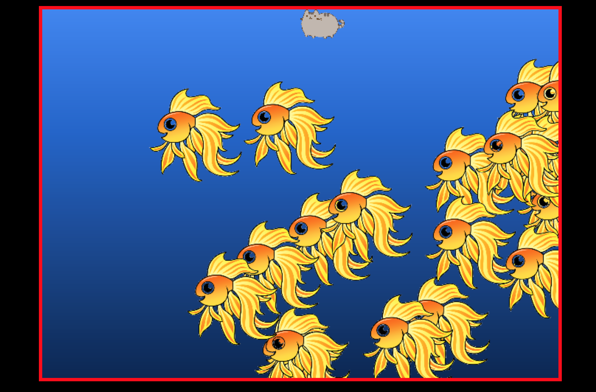

## The Fisher

### Background

The Fisher is a concentration game where users must fire hooks downward in order to "catch fish." Instead of using a human I decided to go with Pusheen, the internet cat.

###Implementing the game

In order to render the game on the browser I decided to use Canvas and Easel js. To start off it allows me to render basic objects and makes interaction between the user and the game easy to handle.

###Playing the game

Users can use the arrow keys or ASD to move left/right, and throw hooks down to catch fish.

